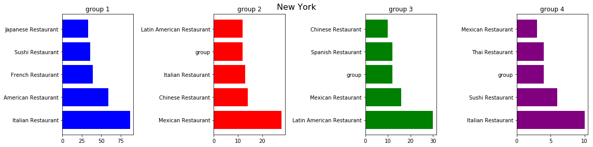

<h1 align=center>IBM capstone project</h1>

### Introduction
#### <i>Go shopping and dining in a city that I am going for vacation</i>  
It's exciting to go somewhere completely new for vacation, but you don't get around knowing where to do what as easily as the locals do. If you happen to have a friend who lives there, what would be the top 3 questions you ask? To me: Where can I have good Asian/Italian/Mexican... food? Where can I go shopping? And in case of emergency (you know), where can I find pharmacy stores? Tourist websites usually have good information about attractions while yelp tells you specific locations to find specific venues, but nothing generic. Won't that be nice if there is a map to tell you what to expect in the city and narrow down your search options?

### Solution  
#### <i>Get venue information based on zip codes</i>
Find all venues within 1km radius of the center of a zipcode region (varies depending on how close they are from each other), and filter the data based on the categories. Next, vizulize the distribution of each categories on the map. Finally, culster the locaitons based on the type of restaraunts and show what kind of foods are most popular in different regions of a city. The database we used here are: 1.uszipcode for coordinates 2.Foursquare for venue information

### Analysis
#### <i>Oveview of zipcode locaitons in New York City</i>
NYC zipcode locations overview - we first take a look at the distribution of zipcode corespondent geographic coordinates in the city

#### <i>Foods and restaurants in New York City</i>
Next let's check where can we find snack food (ice cream, coffee stores, etc.) and restaurants where you can feed yourself.The size of the nodes shows the number of venues at each zip location.
Food

restaurant

#### <i>Shops, Malls and pharmacies </i>
From the map you can see where shops are concentrated at, and the icons show you where to find shopping malls and pharmacies

#### <i>Distribution of restaurants by their categories</i>
Finally, if you are interested in knowing where are the popular types of restaurant in the city, this chart and map can give you that information

